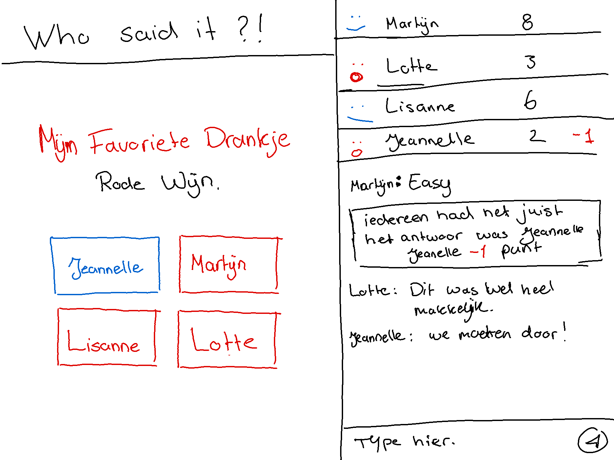
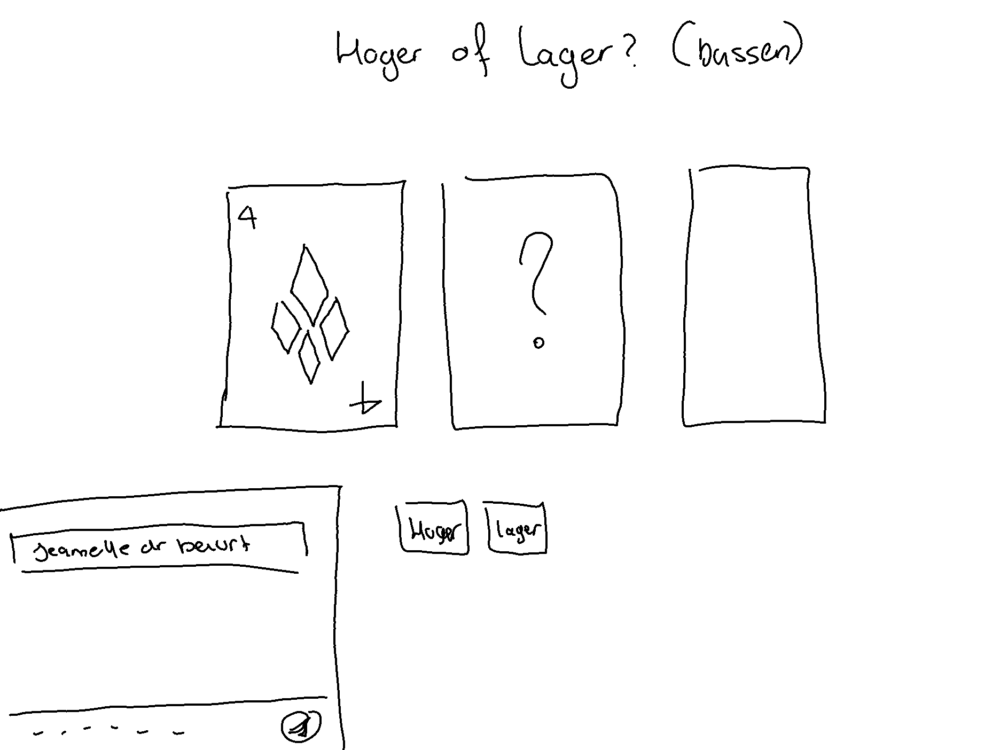
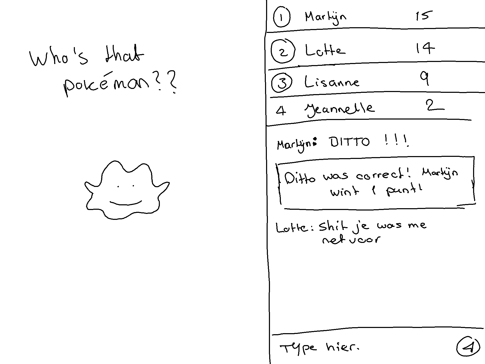
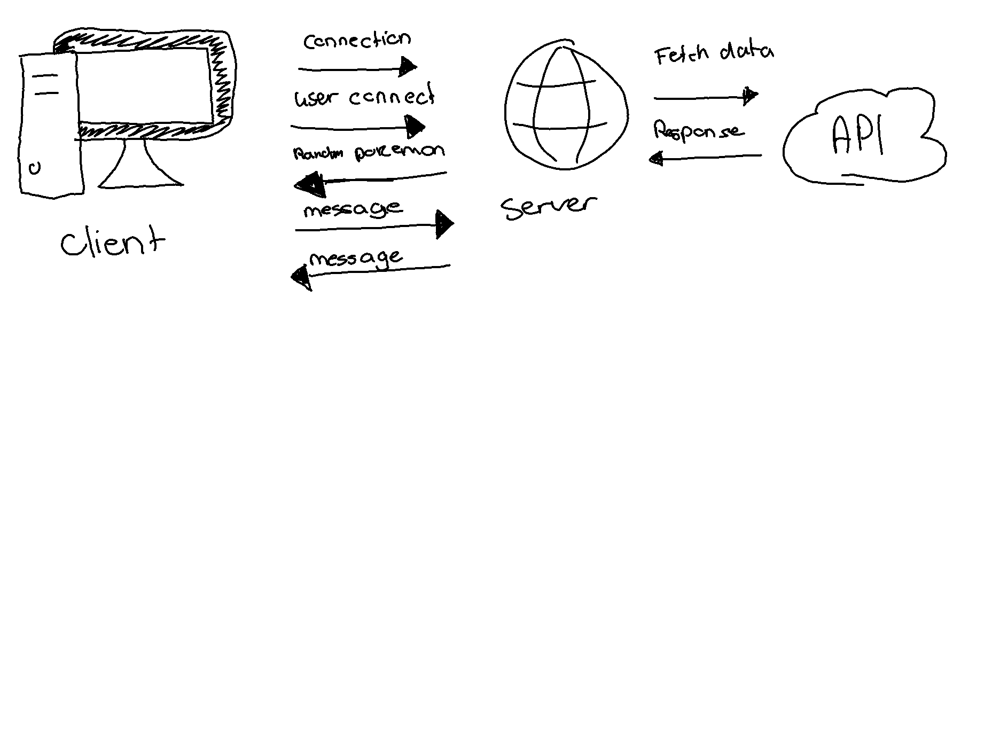

# RTW 

## About Who's That Pokémon

Who's that pokemon is a real-time-app created in Socket.io. The app is a chatroom where you and your friends can talk as well as guess pokémon names. Through the leaderboard, you can keep tabs on who's pokémon knowledge is the greatest!

## Live Demo

[https://rtw-real-time-chat.onrender.com/](https://rtw-real-time-chat.onrender.com/)

## 3 < 1 concept

For this course the idea was to think of (at least) 3 different app ideas these were my ideas!

### Tipsy Tales



My first idea was a game made for friends to play. Everyone gets a question they have to answer, once everyone has done this, 1 of the answers gets displated anonymously. Everyone has to guess who they think gave the answer. When everyone answers right, the person who answered it gets -1 point. Otherwise the people who answer wrong get -1 point. The first one who hits 0 drinks.

### Bussen



The 2nd idea I had was inspired by a dutch drinking game. In essential you have to guess higher or lower than the previous card shown.

### Who's That Pokémon



The last idea I had was a game inspired by an API I found. the pokémon API. Every episode of Pokémon asks 'Who's that pokémon' while showing a greyscaled picture of a pokémon. I wanted to try to recreate this by making it a real-time-app.

I really wanted to make Tipsy Tales but because I spent a long time looking for an API with random questions and didn't find any, I decided to try my luck with the Pokémon API.

## Install

Clone the repository to your local files with:

```
git clone https://rtw-real-time-chat.onrender.com/
```

Install the needed packages with:

```
npm install
```

run the applaction with:

```
npm start  
```

### Used Dependencies

* Express
* Node
* Nodemon
* Node-Fetch
* Socket.io

## Data Model

t.b.a.

## Real Time Events

### Connect

t.b.a.

### User Connect

t.b.a.

### Message

t.b.a.

### Answer

t.b.a.

### Random Pokémon

t.b.a.

### Update Scoreboard

t.b.a.

### User Disconnect

t.b.a.

## Data Life Cycle

